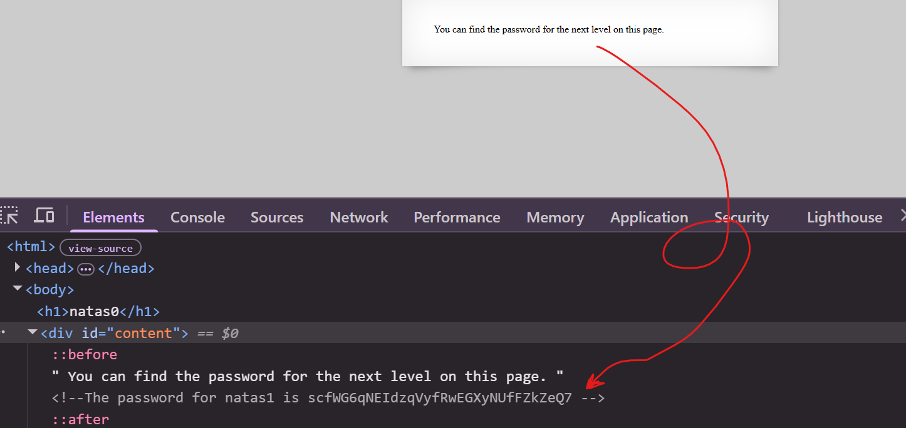

<h1>Natas 0</h1>

<h2>Level Info</h2>

<ul>
  <li><strong>Username:</strong> <code>natas0</code></li>
  <li><strong>Password:</strong> <code>natas0</code></li>
  <li><strong>URL:</strong> <code>http://natas0.natas.labs.overthewire.org</code></li>
</ul>

<h2>Solution</h2>

Simply enter the provided username and password on the login page.

